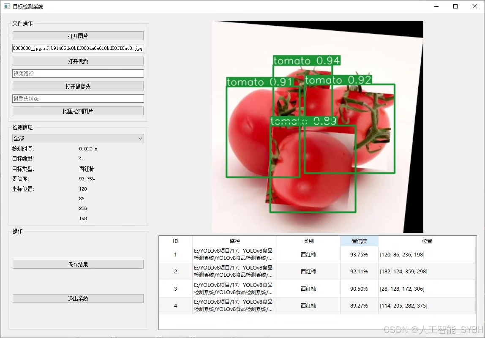
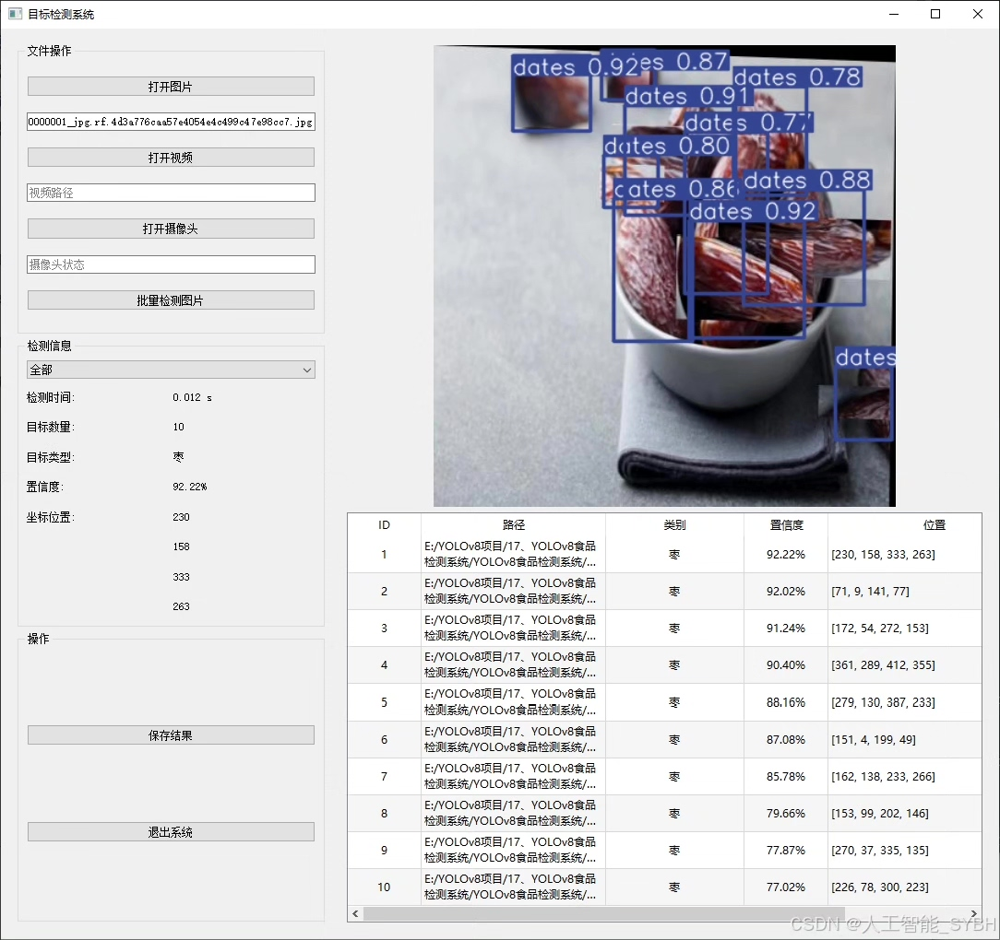
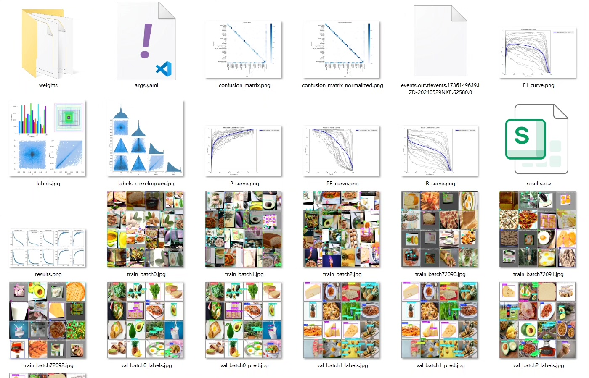
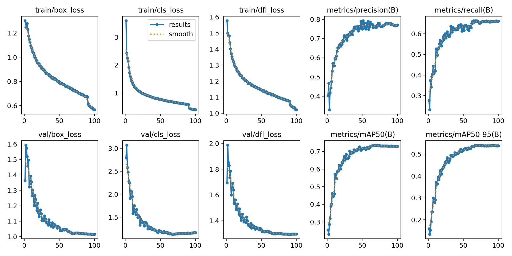
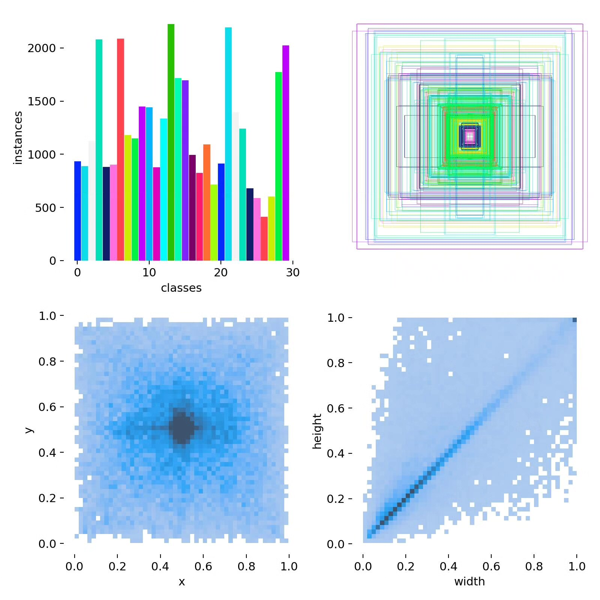
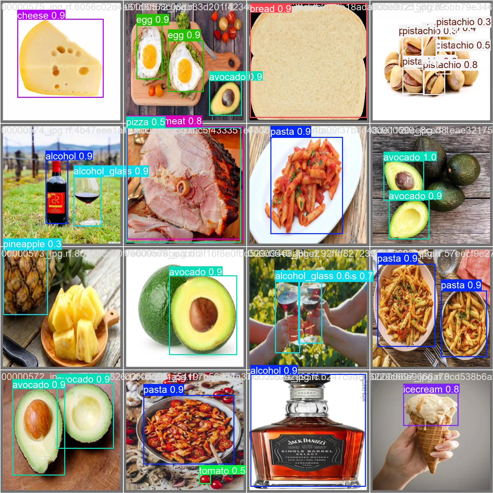
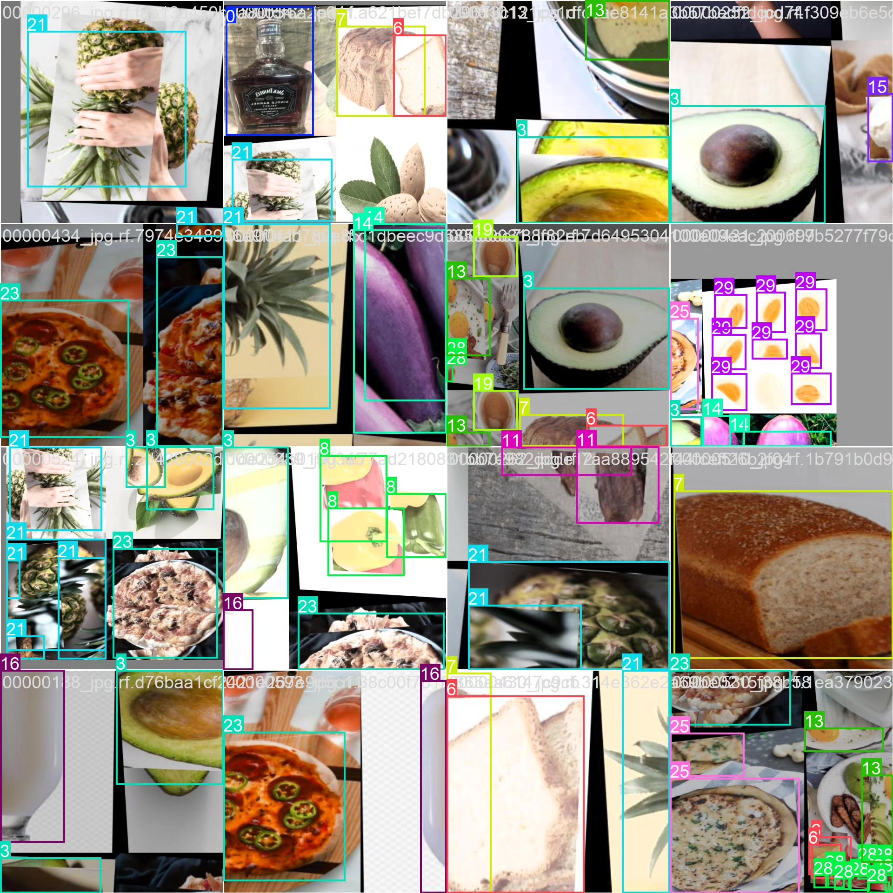

# Allergen food detection system based on YOLOv8 deep learning (YOLOv8+)

## Body

This project is based on the YOLOv8 (You Only Look Once version 8) deep learning object detection framework to build an efficient and precise allergen food detection system. It aims to automatically identify 30 common allergen ingredients in food, including alcohols (alcohol, alcohol_glass), nuts (almond, pistachio), dairy products (milk, cheese), eggs (egg, whole_egg_boiled), fruits (strawberry, blueberry), and other common allergen foods (such as chocolate, bread, pizza, etc.).

Training set: 12802 images
Validation set: 1220 images
Test set: 639 images

The company's product has obtained a YOLO official commercial license certification.

We provide after-sales service.

After payment, we will provide WeChat ID for any questions.

Environment configuration: We will provide a tutorial on environment configuration, and WeChat will provide answers.

Remote installation service: If you need remote configuration, additional fee of 69 is required,
If configuration fails, all fees will be refunded (specially for old computers only refund installation fees)

Retraining dataset: After setting up the environment, you can train on your own computer.
If you need us to retrain, just pay 69 + computing power fee (2.5 yuan/hour)

Full after-sales service

## Images

## Payment

Here is a pay link on Stripe ( https://buy.stripe.com/3cs8yP7sY87d0vu9AB ). Please contact me lonlonago@foxmail.com after funding $89, and I will send you a complete data files , thank you!

